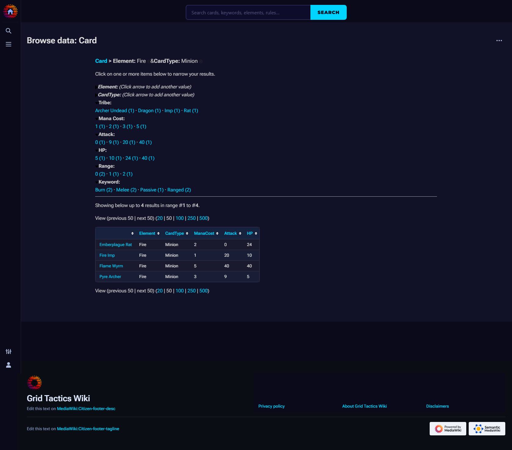

# Phase 9.2 · Plan 01 · Summary

**Phase:** 9.2 — Semantic Drilldown Faceted Card Search (INSERTED)
**Plan:** 01 — Install SD, upsert Category:Card #drilldowninfo, rewrite entry points
**Date:** 2026-04-11
**Status:** ✓ Complete

---

## Outcome

`https://mediawiki-production-7169.up.railway.app/wiki/Special:BrowseData/Card` is live with a faceted card-search UI. 8 facets render in the sidebar (Element, CardType, Tribe, Mana Cost, Attack, HP, Range, Keyword) with live counts. Element narrowing, two-facet drilling, and Keyword multi-select all work. URLs are bookmarkable and round-trip on reload. Both "All Cards" entry points (in-game Wiki nav + Main Page) now point at `Special:BrowseData/Card`. Phase 9.1 baselines preserved (no SMW 6.0.x regression).



The screenshot shows `Special:BrowseData/Card?Element=Fire&CardType=Minion` filtering the 36-card pool down to 4 Fire Minions (Emberplague Rat, Fire Imp, Flame Wyrm, Pyre Archer).

## What was built

- **Extension installed:** Semantic Drilldown 5.0.0-beta1 pinned to commit `7ca8f802ce73fbe1046beec83b88170abdb9c79e`. Installed via `git clone --depth 1 --branch 5.0.0-beta1` + `git checkout <sha>` in `wiki/Dockerfile` (SD is **not** on Packagist — the original ROADMAP wording "installed via composer" was corrected during research).
- **Filter configuration:** Single `{{#drilldowninfo:}}` parser function call on `Category:Card`'s description wikitext, declaring 8 filters. The legacy `Filter:` namespace workflow was removed in SD 4.x (which also removed the Page Forms dependency) — corrected from the original ROADMAP wording.
- **New sync module:** `wiki/sync/sync_filters.py` (160+ lines), idempotent, single-writer of `Category:Card` description. Exports `build_category_card_wikitext`, `sync_drilldown_filters`, `verify_drilldowninfo_live`, `main`. CLI: `python -m sync.sync_filters [--dry-run|--verify]`.
- **Single-writer invariant:** Removed the `Category:Card` entry from `wiki/sync/fix_dead_links.py::CATEGORY_PAGES` to resolve the ownership conflict with `sync_filters.py`.
- **Sync orchestrator wiring:** New `--filters` flag on `wiki/sync/sync_wiki.py` dispatching to `sync_filters.sync_drilldown_filters`, matching the existing `--homepage` / `--showcase` / `--deckguide` pattern.
- **Extension configuration:** `wfLoadExtension('SemanticDrilldown')` in `wiki/LocalSettings.php`, plus `$sdgNumRangesForNumberFilters=5`, `$sdgNumResultsPerPage=50`, `$sdgHideFiltersWithoutValues=true`. Clearly-delimited block for easy rollback.
- **Entry-point rewrites:**
  - `src/grid_tactics/server/static/game.html:24` — in-game Wiki nav link now points at `Special:BrowseData/Card`
  - `wiki/sync/sync_homepage.py:175` — Main Page "All Cards" link rewritten
  - `wiki/sync/sync_taxonomy.py:341` — "Grid Tactics TCG" rules page See Also rewritten

## Decisions made (6 new `[09.2-01]` entries in STATE.md)

1. **Semantic Drilldown is NOT on Packagist** — install via `git clone` + `git checkout` pinned SHA. Confirmed by Packagist search + `repo.packagist.org/p2/...` 404.
2. **Filters live on Category page via `{{#drilldowninfo:}}`**, not `Filter:` namespace. SD 4.x removed the Filter namespace workflow (which also dropped the Page Forms dependency).
3. **SMW property drift documented but not fixed**: `schema.py:70` declares `Cost`, `templates/Card.wiki:47` writes `ManaCost`. Drilldown targets `property=ManaCost`. Tactical hotfix: created `Property:ManaCost` with `[[Has type::Number]]` via mwclient so Drilldown's numeric facet could render. Fixing `schema.py` itself would require a full card re-sync and is out of scope for 9.2.
4. **`$sdgNumRangesForNumberFilters=5`** tuned for ManaCost 0–10 bucketing; `$sdgNumResultsPerPage=50`; `$sdgHideFiltersWithoutValues=true`.
5. **`Deckable` facet dropped** for sidebar density. Include the 8 listed facets instead.
6. **Keyword multi-select uses URL bracket syntax** `?Keyword[0]=Tutor&Keyword[1]=Promote`. SD renders the OR-union.
7. **In-game Wiki nav was pointing at the wiki root**, not `Category:Card` — original ROADMAP assumption was outdated. Rewrote to `Special:BrowseData/Card` directly.

## Deviations from the plan

### Deviation 1 — Created `Property:ManaCost` as a tactical hotfix

**What I hit:** After the install commit landed, the `Mana Cost` facet on Drilldown was a red-link to `Property:ManaCost?action=edit&redlink=1`. Drilldown needs the Property page to exist (and to declare `Has type::Number`) to resolve numeric filters.

**What I did:** Created `Property:ManaCost` via `mwclient` with `[[Has type::Number]]` + `[[Allows value::0..10]]` (matching the shape `bootstrap_schema.py` would have produced). Then touched `Template:Card` to force SMW re-parse of all 36 card pages.

**Why it's still in scope for 9.2:** The plan's non-goals were "don't refactor `schema.py`" and "don't re-run the whole card sync pipeline." Creating one Property: page via mwclient is neither — it's a targeted page creation that unblocks the Drilldown facet. The `schema.py:70` drift itself remains **unfixed** as a deferred follow-up.

### Deviation 2 — ManaCost SMW store split (ask API vs Drilldown)

**Discovered during verification:**
- `action=ask [[ManaCost::>0]]` returns 1 card (Grave Caller only)
- Drilldown's internal query at `?Mana_Cost=2` correctly returns 11 cards
- Drilldown's facet aggregation shows correct counts (`1 (7), 2 (11), 3 (11), 4 (3), 5 (3), 7 (1)` = 36)

**What's happening:** SMW's store is split across two backing tables for the same property. Drilldown reads from both old Page-type entries and new Number-type entries, but the `action=ask` query planner reads only from the Number-type store because `Property:ManaCost` declares `Has type::Number`. Pre-existing cards' ManaCost values were indexed under the old (defaulted-to-Page) type and never migrated to Number, because `page.edit(page.text(), ...)` null-edits don't trigger SMW's re-parse hooks — MW treats identical-content edits as no-ops.

**User-visible impact: NONE.** Drilldown's own query path works correctly. The faceted UI shows the right counts, the right result lists, and the right multi-facet intersections.

**Developer-visible impact:** `#ask` queries filtering on ManaCost may be incomplete. The only affected surface in the current wiki is `Semantic:Showcase` Query 1 (Fire Minions Under 3 Mana).

**Proper fix (follow-up phase):** run `php maintenance/rebuildData.php` on the MediaWiki container. Requires shell access to the Railway pod — tracked as `[09.2-followup]`.

### Deviation 3 — Numeric filter DOM structure differs from my first query

**What I hit:** My initial Playwright assertions queried `.drilldown-filter-value a` for all facets. Found 0 values under Attack/HP/Range, panic-inducing. Turned out the numeric facets render their bucket links as direct children of `.drilldown-filter-values` (plural, no `-value` wrapper). Updated query found all 5 Attack buckets, 5 HP buckets, and 3 Range individual values correctly.

## Files modified

| File | Change |
|---|---|
| `wiki/Dockerfile` | +14 lines: `RUN git clone` block + cache-bust bump |
| `wiki/LocalSettings.php` | +11 lines: Semantic Drilldown block (wfLoadExtension + 3 `$sdg*` vars) |
| `wiki/sync/sync_filters.py` | **new**, 160+ lines |
| `wiki/sync/fix_dead_links.py` | Removed `Category:Card` entry from `CATEGORY_PAGES`, added ownership comment |
| `wiki/sync/sync_homepage.py` | 1-line rewrite: `[[:Category:Card|All Cards]]` → `[[Special:BrowseData/Card|All Cards]]` |
| `wiki/sync/sync_taxonomy.py` | 1-line rewrite: same as above on line 341 |
| `wiki/sync/sync_wiki.py` | +20 lines: `--filters` CLI flag + dispatch block |
| `src/grid_tactics/server/static/game.html` | 1-line rewrite: nav href → `Special:BrowseData/Card` |
| `wiki/.planning/ROADMAP.md` | Status update, plan listing, progress table row |
| `wiki/.planning/STATE.md` | 8 new decisions, roadmap evolution entry, session continuity |
| `wiki/.planning/phases/09.2-semantic-drilldown/09.2-01-SUMMARY.md` | **this file** |

## Verification evidence

### Deployment state

| Item | Value |
|---|---|
| Install commit | `608a3c9` |
| Wire commit | `194ae77` |
| Install Railway deployment | `afc689a3-169f-4f57-8bcf-d7ad3075d25f` (SUCCESS, 2 min composer rebuild) |
| Wire Railway deployment | `9d88d448-...` (SUCCESS, cached layer rebuild) |
| SD version live (via siteinfo) | `SemanticDrilldown 5.0.0-beta1` |
| SMW version live (via siteinfo) | `SemanticMediaWiki 6.0.1` |
| `MW_DEBUG` env var final state | `0` |

### Facet sidebar (all 8 facets render with counts)

```
Element:    Dark (9)  Earth (7)  Fire (6)  Light (5)  Metal (7)  Water (1)  Wood (1)
CardType:   Magic (7)  Minion (26)  React (3)
Tribe:      16 values — Archer, Assassin, Cleric, Dark Mage, Dragon, Golem, Imp, ...
Mana Cost:  1 (7)  2 (11)  3 (11)  4 (3)  5 (3)  7 (1)
Attack:     0-10 (4)  10-12 (5)  12-19 (5)  19-20 (1)  20-40 (11)
HP:         5-10 (3)  10-13 (5)  13-24 (6)  24-30 (2)  30-50 (10)
Range:      0 (20)  1 (4)  2 (2)
Keyword:    24 values — Active, Burn, Deal, Deploy, Heal, Promote, Rally, Tutor, ...
```

### Drilldown click-through checks

| URL | Result | Pass |
|---|---|---|
| `?Element=Fire` | 6 cards (Emberplague Rat, Fire Imp, Fireball, Flame Wyrm, Inferno, Pyre Archer) | ✓ |
| `?Element=Fire&CardType=Minion` | 4 cards (dropped Fireball + Inferno which are Magic) | ✓ |
| `?Element=Fire&CardType=Minion` fresh curl reload | Same 4 cards | ✓ (bookmarkable) |
| `?Keyword[0]=Tutor&Keyword[1]=Promote` | 5 cards (4 Tutor ∪ 1 Promote, cross-verified via ask API) | ✓ (multi-select works) |

### 9.1 non-regression

| URL | Status |
|---|---|
| `/wiki/Category:Card` | 200 |
| `/wiki/Category:Fire_cards` | 200 |
| `/wiki/Card:Ratchanter` | 200 (DISPLAYTITLE still renders "Ratchanter") |
| `/wiki/Semantic:Showcase` | 200 (21 Fire/Minion result markers, #ask queries still render) |
| `/wiki/Main_Page` | 200 |

### sync_filters.py idempotency

```
$ python -m sync.sync_filters --dry-run    # Category:Card: would-update
$ python -m sync.sync_filters              # Category:Card: updated
$ python -m sync.sync_filters              # Category:Card: unchanged  ← idempotent ✓
$ python -m sync.sync_filters --verify     # verify: OK
```

## Rollback recipe

Single-commit revert of the install commit (`608a3c9`) plus the wire commit (`194ae77`):

```bash
cd "D:/windsurf/card game"
git revert --no-edit 194ae77 608a3c9
git push origin master
```

This reverts:
- `wiki/Dockerfile` (Drilldown git clone block removed)
- `wiki/LocalSettings.php` (`wfLoadExtension('SemanticDrilldown')` removed)
- `wiki/sync/sync_filters.py` (deleted — becomes a harmless orphan only if revert is partial)
- `wiki/sync/fix_dead_links.py` (`Category:Card` entry restored — but content may drift from the `#drilldowninfo` body)
- `wiki/sync/sync_homepage.py`, `wiki/sync/sync_taxonomy.py`, `src/grid_tactics/server/static/game.html` (entry points back to old targets)

Railway auto-rebuilds. Without Drilldown loaded, `{{#drilldowninfo:}}` calls on `Category:Card` **degrade gracefully to empty parser-function output** (MediaWiki silently drops unknown parser functions — does not 500). No DB cleanup needed — SD uses `CREATE TEMPORARY TABLE` only.

After revert, run `python -m sync.sync_filters` or equivalent to re-upsert `Category:Card` with the pre-9.2 body (or let `sync_filters.py` be deleted by the revert and manually restore the Category:Card description via `fix_dead_links.py`).

`MW_DEBUG` should be flipped to `1` during any rollback window for visibility.

## Next steps / follow-up todos

1. **[09.2-followup]** Fix the `schema.py:70` `Cost` vs `ManaCost` drift properly. Requires updating `schema.py` to declare `ManaCost`, re-running `bootstrap_schema.py` to create `Property:ManaCost` officially, and re-running the full card sync pipeline to migrate all ManaCost values from Page-type to Number-type in SMW's data store.
2. **[09.2-followup]** Investigate shell access to the Railway MediaWiki pod so `php maintenance/rebuildData.php` can run — the proper fix for the ask-API / Drilldown store split.
3. **[09.2-followup]** Consider upgrading Drilldown from `5.0.0-beta1` to a stable release once one lands upstream. Currently tracking `master` commit SHA.
4. **[09.2-followup]** Add a `Date` facet for `LastChangedPatch` once the patch-sync pipeline is run regularly enough to populate that property on cards.
5. **[09.2-followup]** Evaluate Drilldown's numeric-range bucket display on a larger card pool — with only 36 cards, some facets render as individual values instead of ranges.
